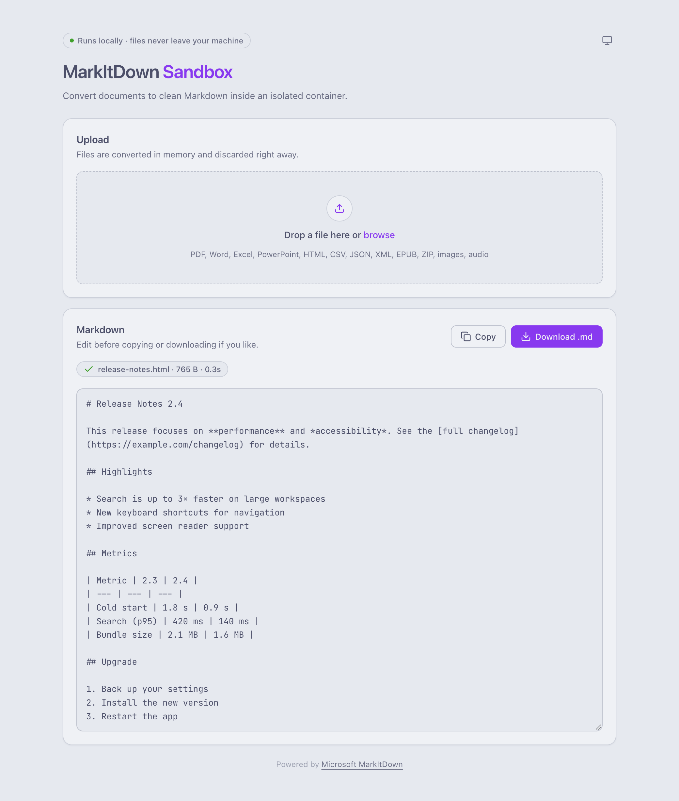

# markitdown-sandbox

Document → Markdown via Docker. A thin terminal wrapper around [Microsoft MarkItDown](https://github.com/microsoft/markitdown)
that converts documents (Word, Excel, PDF, PowerPoint, images, audio, HTML, and more) to
clean Markdown — without installing Python or MarkItDown on your machine. Everything runs
inside an isolated Docker container with strict security hardening.

Use it from the terminal, or through a local [web UI](#web-ui):

<picture>
  <source media="(prefers-color-scheme: dark)" srcset="docs/screenshot-dark.png">
  
</picture>

## Requirements

- Docker

## Install

The wrapper is a single script. Download it into a folder on your `PATH`:

```sh
mkdir -p ~/.local/bin
curl -fsSL https://raw.githubusercontent.com/elalemanyo/markitdown-sandbox/main/markitdown \
  -o ~/.local/bin/markitdown
chmod +x ~/.local/bin/markitdown
```

(Make sure `~/.local/bin` is on your `PATH`, or use `/usr/local/bin` with `sudo` instead.)

The first run pulls the prebuilt image `ghcr.io/elalemanyo/markitdown-sandbox` (amd64 and
arm64) automatically.

### Build the image yourself

If you prefer not to pull a prebuilt image, clone the repository and build it locally. It is
tagged with the same name, so the wrapper uses your local build:

```sh
git clone https://github.com/elalemanyo/markitdown-sandbox.git
cd markitdown-sandbox
docker compose build
ln -s "$PWD/markitdown" ~/.local/bin/markitdown
```

## Usage

From any directory, convert a file and redirect the output, or use `-o`:

```sh
markitdown sample.docx > sample.md
markitdown ~/Desktop/budget.xlsx -o budget.md
markitdown ../reports/user_guide.pdf > user_guide.md
cat page.html | markitdown -x html > page.md
```

Relative paths, `../` paths and absolute paths all work: the wrapper mounts your current
directory, plus the directory of each file argument, read-only at the same path inside the
container.

All MarkItDown options are passed through (`markitdown --help`). The wrapper adds:

| Option / variable | Effect |
| --- | --- |
| `-o`, `--output FILE` | Write to `FILE` on the host (the container itself can't write to your disk). The file is only replaced if the conversion succeeds. |
| `--offline` | Run the container with no network access (`--network none`). |
| `--ui` | Start the web UI instead (see below). |
| `MARKITDOWN_IMAGE` | Image to run instead of `ghcr.io/elalemanyo/markitdown-sandbox:latest`. |
| `MARKITDOWN_PORT` | Host port for `--ui` (default `8000`). |

## Web UI

Prefer the browser? Start the UI and open <http://localhost:8000>, then drop in a file to
get Markdown back, ready to copy or download:

```sh
markitdown --ui
```

No wrapper installed? Run the image directly:

```sh
docker run --rm -p 127.0.0.1:8000:8000 \
  --read-only --tmpfs /tmp:size=64m,noexec,nosuid --cap-drop ALL \
  --security-opt no-new-privileges:true \
  ghcr.io/elalemanyo/markitdown-sandbox:latest serve
```

Or, from a clone: `docker compose up ui`.

The UI receives files over HTTP and converts them in memory, so no host directory is
mounted. It is published on `127.0.0.1` only. Keep that `127.0.0.1:` prefix: a bare
`-p 8000:8000` would expose an unauthenticated converter to your whole network. Uploads
are capped at 50 MB (set `MAX_UPLOAD_MB` in the container to change it).

## Supported formats

MarkItDown with the `[all]` extras handles:

- Word (`.docx`), Excel (`.xlsx`), PowerPoint (`.pptx`)
- PDF
- Images (EXIF metadata, OCR), audio (metadata, speech transcription)
- HTML, CSV, JSON, XML
- ZIP archives (recursively), EPUB, YouTube URLs, and more

See the [MarkItDown repository](https://github.com/microsoft/markitdown) for the full list.

## How it works

- `Dockerfile` — multi-stage build: installs `markitdown[all]` into an isolated prefix and
  runs it as an unprivileged, read-only container.
- `requirements.txt` — the pinned MarkItDown version.
- `compose.yml` — local build configuration with hardened defaults, plus a `ui` service.
- `app/` — the container entrypoint and the web UI (a small standard-library HTTP server
  and a single HTML page; no extra dependencies).
- `markitdown` — the wrapper script. It runs the image with the current directory mounted
  read-only, drops all capabilities, disables new privileges, and uses tmpfs for scratch
  space. The container only writes to stdout; `-o` is handled by the wrapper on the host,
  so you never depend on the container writing to your disk.

## Security notes

- The container runs as your user ID with a read-only root filesystem and a **read-only**
  bind mount of your current directory: it cannot modify or delete files on your host.
- Outbound network is enabled by default because some conversions (e.g. YouTube URLs)
  need it. Use `--offline` for sensitive documents to guarantee nothing leaves the
  container.

## Known harmless warnings

On first run you may see a line like:

```
onnxruntime cpuid_info warning: Unknown CPU vendor. cpuinfo_vendor value: 0
```

This comes from `onnxruntime` (bundled with `markitdown[all]`) failing to identify the CPU
vendor inside the container (common on Apple Silicon). It is **benign**: it is written to
stderr, never stdout, so it cannot corrupt `markitdown file.docx > file.md` output. There is
no supported way to suppress it.

## Updating

MarkItDown is pinned in `requirements.txt`. Dependabot opens a pull request when a new
version is released, and CI rebuilds the image weekly to pick up base-image security
patches. To update locally, run `docker pull ghcr.io/elalemanyo/markitdown-sandbox:latest`
(or `docker compose build --pull` for a local build).

## License

[MIT](LICENSE). MarkItDown itself is © Microsoft Corporation, also under the MIT license.
